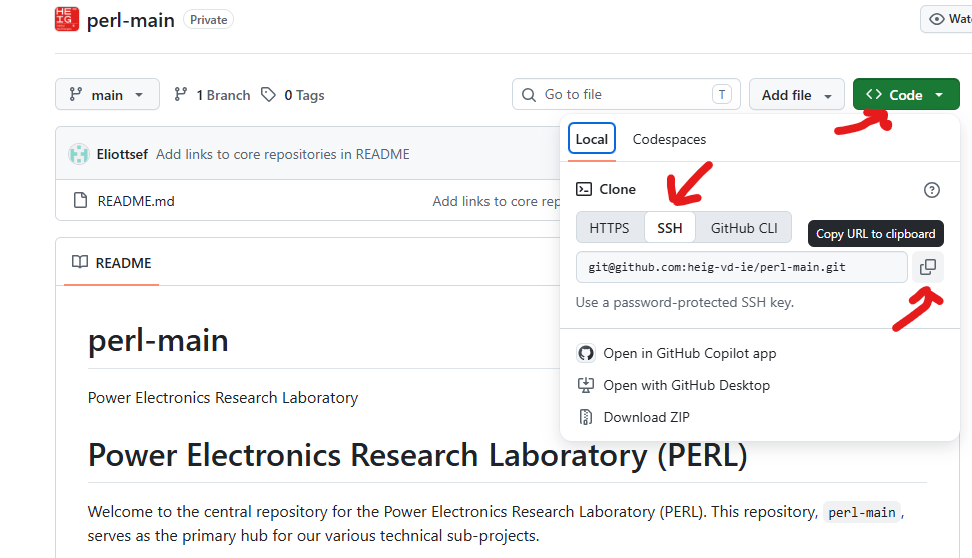
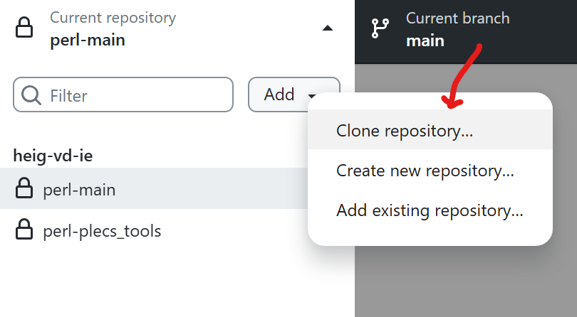

# Environnement Setup

This guide will walk you through setting up a Python environement. 

## Install WSL (Windows Subsystem for Linux)

- **Install Windows Terminal:**
  - Download from the [Windows Store](https://apps.microsoft.com/store/detail/windows-terminal/9N0DX20HK701?hl=fr-ch&gl=ch&rtc=1) (already installed on Windows 11).
  
- **Set up WSL:**
  - Run Windows Terminal as *administrator* and execute:  
    ```bash
    wsl --install
    ```
  - Restart your computer, set up your Ubuntu user (username in small letters and password).

- **Update Linux Distribution:**
  - On Ubuntu terminal run :
  ```bash
  sudo apt-get update
  sudo apt-get install wget ca-certificates
  ```

## Install Visual Studio Code

VS Code is a source-code editor, it include usefull features like debugging support, code completion, code refactoring, syntax highlighting and embedded git control.

Use this installation [help](https://code.visualstudio.com/docs/setup/windows#_install-vs-code-on-windows) to guide you through the *VSCode* installation.

Then install the following extensions : 
- Jupyter
- Python
- Pylance
- Python Debugger
- Python Environement
- WSL

> Go to [Developing in WSL](https://code.visualstudio.com/docs/remote/wsl) for more information about the installation and operation.

## Git Setup

Be sure git is installed correctly on your computer by following [this quick tutorial](https://linuxhint.com/install-git-on-windows/). After installation, restart the computer. 

In Ubuntu/WSL Terminal, follow the next steps :

### 1. Configure Git

- **Set up your Git identity:**
  ```bash
  git config --global user.name "Your Name"
  git config --global user.email "your.name@example.ch"
  ```
- Confirm that the Git username is set correctly:
  ```bash
  $ git config --global user.name
  > Your Name
  $ git config --global user.email
  > your.name@example.ch
  ```
### 2. Set Up SSH for GitHub

- **Generate SSH Key:**
  ```bash
  ssh-keygen -t ed25519 -C "your_email@example.ch"
  ```
  When you're prompted to "Enter a file in which to save the key", you can press Enter to accept the default file location, same for passphrase.
  ```bash
  eval "$(ssh-agent -s)"
  ssh-add ~/.ssh/id_ed25519
  ```

- **Add public SSH Key to GitHub:**
  - Enter in Git Terminal the following command and Copy the generate text  :
    ```bash
    cat ~/.ssh/id_ed25519.pub
    ```
  - Paste it into your GitHub account under *Settings > SSH and GPG keys*.

# Clone Repository
To work locally on your computer, clone a repository.
- **Clone the project repository:**
  
    - Create a folder locally on Ubuntu/WSL. Best practice is to create a folder where all the cloned repositories will be stored.
    - Clone the repository :
        - **Using Ubuntu/WSL Terminal** : First, go to the GitHub website, navigate to the repository page and copy the SSH link as shown in the image below. Then using a Ubuntu/WSL terminal, navigate to the folder you created earlier. Enter the command `git clone` and copy the SSH link and type `yes`to accept the warning.
          ```bash
            git clone git@github.com:heig-vd-ie/rhtlab.git
            ```
            
        - **Using GitHub Desktop** : Go to GitHub Desktop and clone the repository as shown in the following image. Select the repository to clone and the location in Ubuntu/WSL of the folder you created earlier
        


# Install Package Manager

## Install `uv` (fast Python package manager):

Open Ubuntu/WSL and run:

```sh
curl -LsSf https://astral.sh/uv/install.sh | sh
```

Then restart Ubuntu/WSL so `uv` is on your PATH.

## Create the virtual environment
In the Ubuntu/WSL terminal, navigate to the project folder and enter the following commands to create a virtual environment
```sh
uv venv .venv
source .venv/Scripts/activate    
uv pip install -r requirements.txt
```

**3. Activate the environment for subsequent sessions:**

```sh
source .venv/Scripts/activate
```


# Commiting your work with Git
<summary> Commiting your work with Git </summary>

To add all the changes you've made:

```bash
git add .
```

To commit them:

```bash
git commit -m "MY MESSAGE HERE"
```

> [!NOTE]
> `-m` is the message flag here. The message is really important in order for tracking your work via git.

You can also put those steps together like this:

```bash
git commit -a -m "MY MESSAGE HERE"
```

To push your committed changes from your local repository to your remote repository:

```bash
git push origin master
```
It is also possible to use [GitHub directly within VSCode](https://code.visualstudio.com/docs/sourcecontrol/github) to make it easier to use. 

More information about these steps:

- [How to commit and push?](https://stackoverflow.com/questions/19576116/how-to-add-multiple-files-to-git-at-the-same-time)


If you get many problems with your git branch or repo, please get in touch with [Eliott](mailto:eliott.sefaranga@heig-vd).
